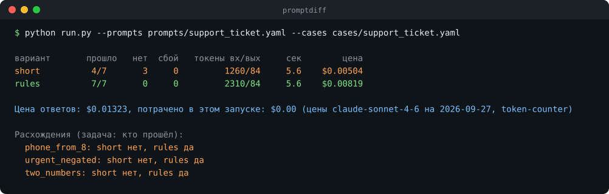

# promptdiff

[](https://github.com/maarshir/promptdiff-/actions/workflows/tests.yml)



<sub>Ответы модели в этом примере написаны вручную и лежат в кэше, остальное программа посчитала сама.</sub>

Поменяли строчку в промпте, и кажется, что стало лучше. promptdiff проверяет это на деле: прогоняет несколько вариантов промпта на одних и тех же задачах и показывает, сколько прошёл каждый, где ответы разошлись и сколько это стоило.

## Как запустить

```bash
git clone https://github.com/maarshir/promptdiff- promptdiff && cd promptdiff
pip install -r requirements.txt
cp .env.example .env   # вписать GROQ_API_KEY (бесплатный) или ANTHROPIC_API_KEY
python run.py --prompts prompts/support_ticket.yaml --cases cases/support_ticket.yaml
```

Нужен Python 3.10+. С `--dry-run` программа только покажет, что уйдёт в модель и во сколько это обойдётся, без единого запроса. Остальные флаги: `python run.py --help`.

## Свои задачи

Задачи лежат в `cases/`, варианты промпта в `prompts/`. Задача это вход и то, что должно или не должно оказаться в ответе:

```yaml
- id: urgent_negated
  input: Не срочно, но подскажите, где сейчас заказ 1204
  expect:
    contains_all: ["urgent=no", "order=1204"]
```

Проверки: `exact`, `contains_all`, `contains_none`. Каждая отвечает только да или нет, без оценок «на глаз».

## Что внутри

- Ответы кэшируются на диске, поэтому повторный прогон тех же промптов ничего не стоит.
- Сбой сети считается отдельно и не выдаётся за плохой ответ.
- Два поставщика, Anthropic и Groq. При превышении лимита программа ждёт столько, сколько попросил сервер.
- Цена каждого варианта считается через [token-counter](https://github.com/maarshir/token-counter).
- 134 теста, запускаются при каждом изменении.

Почему всё устроено именно так: [docs/решения.md](docs/решения.md). Набор вопросов к документам из [doc-answers](https://github.com/maarshir/doc-answers) прогоняется здесь же.
